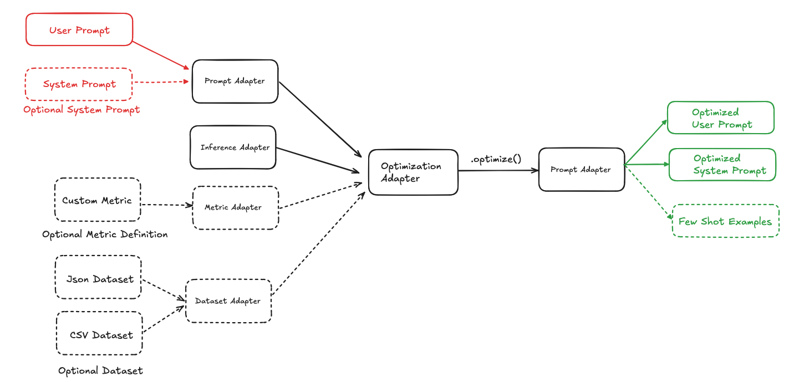

# Nova Prompt Optimizer

A Python SDK for optimizing prompts for Nova models, with an optional web interface for enhanced usability.

## 📚 Table of Contents

* [Getting Started](#getting-started)
  * [Option 1: SDK Only (Python)](#option-1-sdk-only-python)
  * [Option 2: SDK + Web Interface](#option-2-sdk--web-interface)
* [Installation](#installation)
* [Prerequisites](#prerequisites)
* [Quick Start: Facility Support Analyzer Dataset](#quick-start-facility-support-analyzer-dataset)
* [Core Concepts](#core-concepts)
  * [Input Adapters](#input-adapters)
    * [1. Prompt Adapter](#1-prompt-adapter)
    * [2. Inference Adapter](#2-inference-adapter)
    * [3. Dataset Adapter](#3-dataset-adapter)
    * [4. Metric Adapter](#4-metric-adapter)
    * [5. Optimization Adapter](#5-optimization-adapter)
  * [Optimizers](#optimizers)
    * [NovaPromptOptimizer](#novapromptoptimizer)
  * [Evaluator](#evaluator)
* [Web Interface (Optional)](#web-interface-optional)
* [Optimization Recommendations](#optimization-recommendations)
* [Preview Status](#preview-status)
* [Interaction with AWS Bedrock](#interaction-with-aws-bedrock)
* [Acknowledgements](#acknowledgements)

## Getting Started

Choose your preferred way to use Nova Prompt Optimizer:

### Option 1: SDK Only (Python)

Perfect for developers who want to integrate prompt optimization directly into their Python applications or Jupyter notebooks.

**Quick Setup:**

```bash
# Install the SDK
pip3 install nova-prompt-optimizer

# Set up AWS credentials
export AWS_ACCESS_KEY_ID="your_access_key"
export AWS_SECRET_ACCESS_KEY="your_secret_key"
export AWS_REGION="us-east-1"
```

**Jump to:** [Installation](#installation) → [Prerequisites](#prerequisites) → [Quick Start](#quick-start-facility-support-analyzer-dataset)

### Option 2: SDK + Web Interface

Ideal for teams who want an intuitive web interface for dataset management, prompt editing, and optimization workflows.

**Quick Setup:**

```bash
# Clone the repository
git clone <repository-url>
cd nova-prompt-optimizer

# Deploy with Docker (includes SDK + Web UI)
cd ui
cp .env.example .env
# Edit .env with your AWS credentials and configuration
./scripts/deploy.sh deploy
```

**Access:**

* Web Interface: <http://localhost>
* API Documentation: <http://localhost:8000/docs>

**Jump to:** [Web Interface Setup](#web-interface-optional)

---

## Installation

### SDK Installation

Install the core Nova Prompt Optimizer SDK:

```bash
pip3 install nova-prompt-optimizer
```

### Web Interface Installation (Optional)

If you want the web interface, you'll need Docker and Docker Compose:

```bash
# Check if Docker is installed
docker --version
docker-compose --version

# If not installed, visit: https://docs.docker.com/get-docker/
```

## Prerequisites

### AWS Configuration

#### 1. Set up AWS Credentials

To use the SDK, you need AWS credentials configured. See the [AWS CLI configuration documentation](https://docs.aws.amazon.com/cli/latest/userguide/cli-chap-configure.html#config-settings-and-precedence) for details on the various ways to configure credentials.

**Option A: Environment Variables (Recommended for testing)**

```bash
export AWS_ACCESS_KEY_ID="your_access_key"
export AWS_SECRET_ACCESS_KEY="your_secret_key"
export AWS_REGION="us-east-1"
```

**Option B: AWS CLI Configuration**

```bash
aws configure
# Follow prompts to enter your credentials
```

**Option C: IAM Roles (Recommended for production)**

Use IAM roles when running on EC2, ECS, or other AWS services.

#### 2. Enable Nova Model Access

1. Go to the [Amazon Bedrock Model Access page](https://console.aws.amazon.com/bedrock/home#/modelaccess)
2. Click "Manage model access"
3. Choose Amazon as provider and select Nova models
4. Click "Request access"
5. Wait for approval (usually instant)

#### 3. Required IAM Permissions

Ensure your AWS credentials have the following permissions:

```json
{
    "Version": "2012-10-17",
    "Statement": [
        {
            "Effect": "Allow",
            "Action": [
                "bedrock:InvokeModel",
                "bedrock:InvokeModelWithResponseStream"
            ],
            "Resource": [
                "arn:aws:bedrock:*::foundation-model/amazon.nova-*"
            ]
        }
    ]
}
```

## Quick Start: Facility Support Analyzer Dataset

The Facility Support Analyzer dataset consists of emails that are to be classified based on category, urgency and sentiment.

### Using the SDK (Python)

Please see the [samples](samples/facility-support-analyzer/) folder for example notebooks of how to optimize a prompt in the scenario where a [user prompt template is to be optimized](samples/facility-support-analyzer/user_prompt_only) and the scenario where a [user and system prompt is to be optimized together](samples/facility-support-analyzer/system_and_user_prompt).

### Using the Web Interface

1. **Access the Web Interface**: Navigate to <http://localhost> after deployment
2. **Upload Dataset**: Go to Dataset Management and upload the sample CSV/JSON file
3. **Create Prompt**: Use the Prompt Workbench to create your optimization prompt
4. **Run Optimization**: Configure and start optimization in the Optimization Workflow
5. **View Results**: Analyze results and export optimized prompts

## Core Concepts

### Input Adapters

We break each component of Prompt Optimization into Adapters providing a modular approach to Prompt Optimization.



### 1. Prompt Adapter

**Responsibility:** Ability to load prompts from different formats and store them in the standardized format (JSON)

**Sample Prompt Adapter Initialization**

```python
from amzn_nova_prompt_optimizer.core.input_adapters.prompt_adapter import TextPromptAdapter

prompt_adapter = TextPromptAdapter()

prompt_adapter.set_system_prompt(file_path="prompt/sys_prompt.txt", variables={"foo"})

prompt_adapter.set_user_prompt(content="You are a .....", variables={"bar"})

prompt_adapter.adapt()
```

**Supported Prompt Adapters:** `TextPromptAdapter`

Learn More about the Prompt Adapter [here](docs/PromptAdapter.md)

### 2. Inference Adapter

**Responsibility:** Ability to call an inference backend for the models e.g. Bedrock, etc.

**Sample use of Inference Adapter**

```python
from amzn_nova_prompt_optimizer.core.inference.adapter import BedrockInferenceAdapter

inference_adapter = BedrockInferenceAdapter(region_name="us-east-1")
```

You can pass `rate_limit` into constructor of InferenceAdapter to limit the max TPS of bedrock call to avoid throttle. Default to 2 if not set.

```python
from amzn_nova_prompt_optimizer.core.inference.adapter import BedrockInferenceAdapter

inference_adapter = BedrockInferenceAdapter(region_name="us-east-1", rate_limit=10) # Max 10 TPS
```

**Supported Inference Adapters:** `BedrockInferenceAdapter`

**Core Functions**

Call the model using the parameters

```python
# Call the model with the passed parametrs
inference_output = inference_adapter.call_model(model_id: str, system_prompt: str, messages: List[Dict[str, str]], inf_config: Dict[str, Any])
```

The Inference Adapter accepts the `system_prompt` as a string.

The input to the model as a list of User/Assistant turns (messages). e.g. `[{"user": "foo"}, {"assistant": "bar"}, {"user": "What comes next?"}]`

### 3. Dataset Adapter

**Responsibility:** Ability to read/write datasets from different formats. Uses an intermediary standardized format when communicating with other adapters.
It can also read list of JSON object. It can also create Train/Test splits (with stratify capability if set).

**Requirements:** Currently, you can only provide a singleton set as output column.

**Sample Dataset Adapter Initialization**

```python
# Example Usage
from amzn_nova_prompt_optimizer.core.input_adapters.dataset_adapter import JSONDatasetAdapter

input_columns = {"input"}
output_columns = {"answer"}

dataset_adapter = JSONDatasetAdapter(input_columns, output_columns)

# Adapt
dataset_adapter.adapt(data_source="sample_data.jsonl")

# Split
train, test = dataset_adapter.split(0.5)
```

**Supported Dataset Adapters:** `JSONDatasetAdapter`, `CSVDatasetAdapter`

Learn More about the Dataset Adapter [here](docs/DatasetAdapter.md)

### 4. Metric Adapter

**Responsibility:** Ability to load custom metrics and apply them on inference output and ground truth

**Metric Adapter Class**

```python
class MetricAdapter():
    def apply(self, y_pred: Any, y_true: Any) -> float:
        pass

    def batch_apply(self, y_preds: List[Any], y_trues: List[Any]) -> float:
        pass
```

**Sample Custom Metric Adapter Initialization**
Let's create a Custom metric adapter that parses the inference output for the answer between `<answer> </answer>` tags and then performs an exact match metric.

```python
from amzn_nova_prompt_optimizer.core.input_adapters.metric_adapter import MetricAdapter
from typing import List, Any, Dict
import re
import json

class CustomMetric(MetricAdapter):
    def _parse_answer(self, model_output):
        # Parse Answer between tags
        match = re.search(r"<answer>(.*?)</answer>", model_output)
        if not match:
            return "Choice not found"
        return match.group(1).lower().strip()

    def _calculate_metrics(self, y_pred: Any, y_true: Any) -> Dict:
        # Peform Exact Match
        pred = self._parse_answer(y_pred)
        ground_truth = self._parse_answer(y_true)
        return int(pred == ground_truth)

    def apply(self, y_pred: Any, y_true: Any):
        # Apply to one row of the dataset
        return self._calculate_metrics(y_pred, y_true)

    def batch_apply(self, y_preds: List[Any], y_trues: List[Any]):
        # Apply to the whole dataset
        evals = []
        for y_pred, y_true in zip(y_preds, y_trues):
            evals.append(self.apply(y_pred, y_true))
        return sum(evals)/len(evals)

metric_adapter = CustomMetric()
```

**Core Functions**
Apply the metric on a prediction and ground_truth one row at a time

```python
y_pred = "The question asks ...... <answer>3</answer>"
y_true = "<answer>3</answer>"

# Apply the metric on a prediction and ground_truth
score = metric_adapter.apply(y_pred, y_true)

# score = 1
```

Apply the metric on a list of prediction and ground_truth i.e. for the dataset

```python
y_preds = ["The question asks ...... <answer>3</answer>", "The question asks ...... <answer>5</answer>"]
y_trues = ["<answer>3</answer>", "<answer>4</answer>"]

# Apply the metric on a list of prediction and ground_truth
aggregeate_score = metric_adapter.batch_apply(y_preds, y_trues)

# aggregeate_score = 0.5
```

### 5. Optimization Adapter

**Responsibility:** Load Optimizer, Prompt Adapter, and Optionally Dataset Adapter, Metric Adapter, and Inference Adapter. Perform Optimization and ability to create a Prompt Adapter with the Optimized Prompt.

Sample Optimization Initialization

```python
from amzn_nova_prompt_optimizer.core.optimizers import NovaPromptOptimizer

nova_prompt_optimizer = NovaPromptOptimizer(prompt_adapter=prompt_adapter, inference_adapter=inference_adapter, dataset_adapter=train_dataset_adapter, metric_adapter=metric_adapter)

optimized_prompt_adapter = nova_prompt_optimizer.optimize(mode="lite")
```

We can take a look more deeply into the optimizers in the next section.

## Optimizers

### NovaPromptOptimizer

NovaPromptOptimizer is a combination of Meta Prompting using the Nova Guide on prompting and DSPy's MIPROv2 Optimizer using Nova Prompting Tips.
NovaPromptOptimizer first runs a meta prompter to identify system instructions and user template from the prompt adapter.
Then MIPROv2 is run on top of this to optimize system instructions and identify few-shot samples that need to be added.
The few shot samples are added as `converse` format so they are added as User/Assistant turns.

**Requirements:** NovaPromptOptimizer requires Prompt Adapter, Dataset Adapter, Metric Adapter and Inference Adapter.

**Optimization Example**

```python
from amzn_nova_prompt_optimizer.core.optimizers import NovaPromptOptimizer

nova_prompt_optimizer = NovaPromptOptimizer(prompt_adapter=prompt_adapter, inference_adapter=inference_adapter, dataset_adapter=train_dataset_adapter, metric_adapter=metric_adapter)

optimized_prompt_adapter = nova_prompt_optimizer.optimize(mode="lite")
```

NovaPromptOptimizer uses Premier for Meta Prompting and then uses MIPROv2 with 20 candidates and 50 trials with Premier as Prompting model and task model dependent on the mode it's set at.
You can specify enable_json_fallback=False to disable the behavior that MIPROv2 will [fallback to use JSONAdapter to parse LM model output](https://github.com/stanfordnlp/dspy/blob/main/dspy/adapters/chat_adapter.py#L44-L51). This will force MIPROv2 use structured output (pydantic model) to parse LM output.

You could also define a custom mode and pass your own parameter values to NovaPromptOptimizer

```python
from amzn_nova_prompt_optimizer.core.optimizers import NovaPromptOptimizer

nova_prompt_optimizer = NovaPromptOptimizer(prompt_adapter=prompt_adapter, inference_adapter=inference_adapter, dataset_adapter=train_dataset_adapter, metric_adapter=metric_adapter)

optimized_prompt_adapter = nova_prompt_optimizer.optimize(mode="custom", custom_params={"task_model_id": "us.amazon.nova-pro-v1:0",
    "num_candidates": 10,
    "num_trials": 15,
    "max_bootstrapped_demos": 5,
    "max_labeled_demos": 0
})
```

Learn More about the Optimizers [here](docs/Optimizers.md)

## Evaluator

The SDK also provides a way to baseline prompts and provide evaluation scores.
The evaluator has the `aggregate_score` and `scores` function.

**Initialization Example**

```python
from amzn_nova_prompt_optimizer.core.evaluation import Evaluator

evaluator = Evaluator(nova_mp_optimized_prompt_adapter, test_dataset_adapter, metric_adapter, inference_adapter)

nova_mp_score = evaluator.aggregate_score(model_id="us.amazon.nova-lite-v1:0")
```

**Core Functions**

Runs Batch evaluation on the dataset using the batch_apply function of the metric

```python
# Uses Batch Apply
aggregate_score = evaluator.aggregate_score(model_id)
```

Runs evaluation on the dataset a row at a time and returns the eval results as a whole.

```python
# Uses Apply metric. Returns a list of scores.
scores = evaluator.score(model_id)
```

Save the eval results.

```python
# Save the eval results
evaluator.save("eval_results.jsonl")
```

**Note: You may come across the below warning. This is when prompt variables are missing from the prompt, the inference runner under the evaluator appends them to the end of the prompt for continuity**

```python
WARNING amzn_nova_prompt_optimizer.core.inference: Warn: Prompt Variables not found in User Prompt, injecting them at the end of the prompt
```

## Web Interface (Optional)

The Nova Prompt Optimizer includes an optional web interface that provides an intuitive way to manage datasets, create prompts, and run optimizations without writing code.

### Features

* **Dataset Management**: Upload and manage CSV/JSON datasets with automatic processing
* **Prompt Engineering**: Visual prompt editor with variable detection and preview
* **Custom Metrics**: Define evaluation metrics with a Python code editor
* **Optimization Workflows**: Configure and monitor optimization runs with real-time progress
* **AI Rubric Generation**: Generate evaluation rubrics from datasets using AI
* **Human Annotation**: Quality assurance through human annotation workflows
* **Results Analysis**: Comprehensive visualization and comparison of optimization results

### Step-by-Step Deployment

#### Step 1: Clone Repository and Navigate to UI Directory

```bash
# Clone the repository
git clone <repository-url>
cd nova-prompt-optimizer/ui
```

#### Step 2: Configure Environment

```bash
# Copy the example environment file
cp .env.example .env

# Edit the environment file with your configuration
nano .env  # or use your preferred editor
```

**Required Configuration:**

```bash
# Database passwords (generate secure passwords)
POSTGRES_PASSWORD=your_secure_database_password
REDIS_PASSWORD=your_secure_redis_password

# Application secret (generate a secure 32+ character key)
SECRET_KEY=your_very_secure_secret_key_minimum_32_characters

# AWS credentials
AWS_REGION=us-east-1
AWS_ACCESS_KEY_ID=your_aws_access_key
AWS_SECRET_ACCESS_KEY=your_aws_secret_key

# Frontend URLs (for production deployment)
VITE_API_URL=http://localhost:8000  # Change to your domain for production
VITE_WS_URL=ws://localhost:8000     # Change to your domain for production
```

**Optional Configuration:**

```bash
# Performance tuning
API_WORKERS=4
CELERY_WORKER_CONCURRENCY=2

# Security (for production)
CORS_ORIGINS=https://yourdomain.com,https://api.yourdomain.com
ALLOWED_HOSTS=yourdomain.com,api.yourdomain.com

# Monitoring
ENABLE_METRICS=true
SENTRY_DSN=your_sentry_dsn_for_error_tracking
```

#### Step 3: Deploy the Application

**Option A: Using the Deployment Script (Recommended)**

```bash
# Make the deployment script executable
chmod +x scripts/deploy.sh

# Deploy the application
./scripts/deploy.sh deploy

# Check deployment status
./scripts/deploy.sh status
```

**Option B: Using Docker Compose Directly**

```bash
# For development
docker-compose up -d

# For production
docker-compose -f docker-compose.prod.yml up -d

# With monitoring (Prometheus + Grafana)
docker-compose -f docker-compose.prod.yml --profile monitoring up -d
```

#### Step 4: Verify Deployment

1. **Check Service Health**:

   ```bash
   # Using deployment script
   ./scripts/deploy.sh status
   
   # Or check directly
   curl http://localhost:8000/health
   curl http://localhost/health
   ```

2. **Access the Application**:
   * **Web Interface**: <http://localhost>
   * **API Documentation**: <http://localhost:8000/docs>
   * **API Health Check**: <http://localhost:8000/health/detailed>

3. **Optional Monitoring** (if deployed with monitoring profile):
   * **Prometheus**: <http://localhost:9090>
   * **Grafana**: <http://localhost:3000> (admin/admin)

#### Step 5: First-Time Setup

1. **Access the Web Interface**: Open <http://localhost> in your browser

2. **Upload a Sample Dataset**:
   * Go to "Dataset Management"
   * Click "Upload Dataset"
   * Upload a CSV or JSON file with input/output columns
   * Configure column mappings and process the dataset

3. **Create Your First Prompt**:
   * Go to "Prompt Workbench"
   * Click "New Prompt"
   * Create a prompt template with variables like `{{input}}`
   * Preview with sample data

4. **Run an Optimization**:
   * Go to "Optimization Workflow"
   * Select your dataset and prompt
   * Choose Nova Prompt Optimizer
   * Start optimization and monitor progress

5. **View Results**:
   * Review performance improvements
   * Compare original vs optimized prompts
   * Export optimized prompts for use

### Development Setup (Optional)

If you want to modify or contribute to the web interface:

#### Backend Development

```bash
cd ui/backend

# Create virtual environment
python -m venv venv
source venv/bin/activate  # On Windows: venv\Scripts\activate

# Install dependencies
pip install -r requirements.txt
pip install -r requirements-test.txt

# Set up environment
cp .env.example .env
# Edit .env with your configuration

# Run database migrations
alembic upgrade head

# Start development server
uvicorn app.main:app --reload --host 0.0.0.0 --port 8000
```

#### Frontend Development

```bash
cd ui/frontend

# Install dependencies
npm install

# Start development server
npm run dev

# The frontend will be available at http://localhost:5173
```

### Troubleshooting

#### Common Issues

1. **Application Won't Start**:

   ```bash
   # Check Docker is running
   docker info
   
   # Check logs
   ./scripts/deploy.sh logs
   ```

2. **Database Connection Issues**:

   ```bash
   # Check database status
   docker-compose ps db
   
   # View database logs
   docker-compose logs db
   ```

3. **AWS Connection Issues**:
   * Verify AWS credentials are correct
   * Check Nova model access is enabled
   * Ensure IAM permissions are configured

4. **Port Conflicts**:
   * Default ports: 80 (frontend), 8000 (backend), 5432 (database), 6379 (redis)
   * Modify ports in docker-compose.yml if needed

#### Getting Help

* **Logs**: `./scripts/deploy.sh logs [service_name]`
* **Health Check**: `curl http://localhost:8000/health/detailed`
* **Documentation**: <http://localhost:8000/docs-static/>
* **User Guide**: Available in the web interface

### Backup and Recovery

```bash
# Create backup
./scripts/deploy.sh backup

# Restore from backup
./scripts/deploy.sh rollback backups/backup_20240115_143022.tar.gz
```

### Production Considerations

For production deployment:

1. **Use HTTPS**: Configure SSL certificates and update URLs
2. **Secure Passwords**: Use strong, unique passwords for all services
3. **Resource Limits**: Configure appropriate CPU/memory limits
4. **Monitoring**: Enable the monitoring stack for observability
5. **Backups**: Set up automated backup schedules
6. **Updates**: Plan for regular security updates

### Uninstalling

To remove the web interface:

```bash
# Stop and remove containers
docker-compose down -v

# Remove images (optional)
docker-compose down --rmi all -v

# Remove deployment directory
cd ..
rm -rf ui/
```

## Optimization Recommendations

1. Provide representative real-world evaluation sets and split them into training and testing sets. Ensure dataset is balanced on output label when splitting train and test sets.
2. For evaluation sets, the ground truth column should be as close to the inference output as possible. e.g. If the inference output is {"answer": "POSITIVE"} ground truth should also be in the same format {"answer": "POSITIVE"}
3. For NovaPromptOptimizer, choose the mode (mode= "premier" | ""pro" | "lite" | "micro") based on your Nova Model of choice. By default, we use "pro".
4. The `apply` function of the evaluation metric should return a numerical value between 0 and 1 for NovaPromptOptimizer or MIPROv2.

## Preview Status

NovaPromptOptimizer is currently in public preview. During this period:

* SDK functionality might change as we support more use cases.
* We welcome feedback and contributions

## Interaction with AWS Bedrock

NovaPromptOptimizer only uses AWS Bedrock for Model Calls.
[Bedrock by default **disables** model invocation logging](https://docs.aws.amazon.com/bedrock/latest/userguide/model-invocation-logging.html).
Data is not retained in the user's AWS account unless the user enables Bedrock Model Invocation logging.
Data storage by Amazon Bedrock is independent of the use of the SDK.

Please refer to [Amazon Bedrock's Data Protection Guide](https://docs.aws.amazon.com/bedrock/latest/userguide/data-protection.html) for additional guidance

## Additional Resources

### Web Interface Documentation

If you're using the web interface, additional documentation is available:

* **User Guide**: Comprehensive guide for using the web interface (available at `/docs-static/user-guide/` when deployed)
* **API Documentation**: Interactive API documentation at `/docs` when deployed
* **Developer Guide**: For contributing to the web interface (available at `/docs-static/developer/`)

### SDK Documentation

* **Prompt Adapter**: [docs/PromptAdapter.md](docs/PromptAdapter.md)
* **Dataset Adapter**: [docs/DatasetAdapter.md](docs/DatasetAdapter.md)
* **Optimizers**: [docs/Optimizers.md](docs/Optimizers.md)

## Acknowledgements

* Special acknowledgment to [DSPy](https://github.com/stanfordnlp/dspy) – your innovations continue to inspire us.
