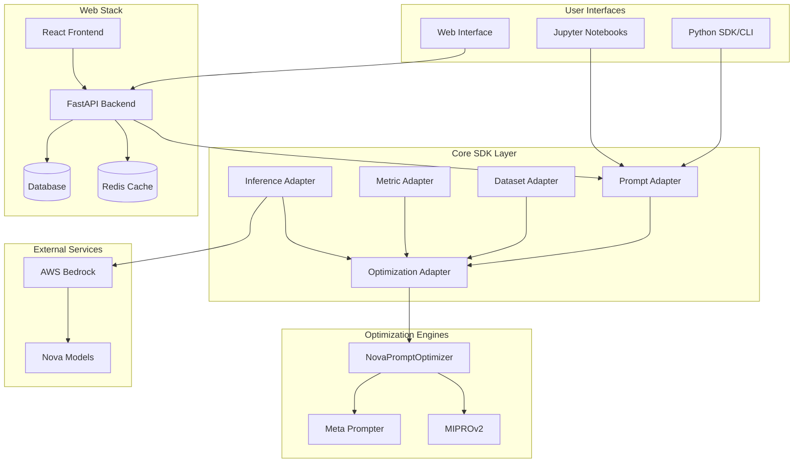

# Nova Prompt Optimizer - Technical Architecture

*Generated by Claude on August 3, 2025*

## System Architecture Overview

### High-Level Architecture



## Core SDK Architecture

### Adapter Pattern Implementation

The SDK is built around a modular adapter pattern where each component handles a specific aspect of the prompt optimization pipeline:

#### 1. Prompt Adapter (`prompt_adapter.py`)

**Responsibility**: Prompt loading, templating, and standardization

```python
class TextPromptAdapter:
    def __init__(self):
        self.system_prompt: Optional[str] = None
        self.user_prompt: Optional[str] = None
        self.variables: Set[str] = set()
    
    def set_system_prompt(self, file_path: str = None, content: str = None, variables: Set[str] = None)
    def set_user_prompt(self, file_path: str = None, content: str = None, variables: Set[str] = None)
    def adapt(self) -> Dict[str, Any]
```

**Key Features**:
- Jinja2 template variable extraction
- System/user prompt separation
- File and content-based loading
- JSON serialization for pipeline compatibility

#### 2. Dataset Adapter (`dataset_adapter.py`)

**Responsibility**: Dataset loading, processing, and ML-ready preparation

```python
class DatasetAdapter(ABC):
    def __init__(self, input_columns: Set[str], output_columns: Set[str]):
        self.input_columns = input_columns
        self.output_columns = output_columns
    
    @abstractmethod
    def adapt(self, data_source: str) -> None
    
    def split(self, test_size: float, stratify: bool = False) -> Tuple[DatasetAdapter, DatasetAdapter]
```

**Implementations**:
- `JSONDatasetAdapter`: JSONL file processing
- `CSVDatasetAdapter`: CSV file processing with column mapping

**Key Features**:
- Automatic train/test splitting
- Stratified sampling for balanced datasets
- Column validation and mapping
- Memory-efficient processing

#### 3. Metric Adapter (`metric_adapter.py`)

**Responsibility**: Custom evaluation metrics with batch processing

```python
class MetricAdapter(ABC):
    @abstractmethod
    def apply(self, y_pred: Any, y_true: Any) -> float
    
    def batch_apply(self, y_preds: List[Any], y_trues: List[Any]) -> float
```

**Key Features**:
- Single-row and batch evaluation modes
- Numerical scoring (0-1 range for optimizers)
- Extensible base class for custom metrics
- Built-in aggregation support

#### 4. Inference Adapter (`adapter.py`)

**Responsibility**: AWS Bedrock integration with safety and reliability features

```python
class BedrockInferenceAdapter:
    def __init__(self, region_name: str, rate_limit: int = 2):
        self.bedrock_client = boto3.client('bedrock-runtime', region_name=region_name)
        self.rate_limiter = RateLimiter(rate_limit)
    
    def call_model(self, model_id: str, system_prompt: str, messages: List[Dict], inf_config: Dict) -> str
```

**Key Features**:
- Configurable rate limiting (TPS control)
- Nova model support with model-specific configurations
- Converse API integration
- Error handling and retry logic
- Cost optimization through rate limiting

#### 5. Optimization Adapter

**Responsibility**: Orchestrates optimization algorithms with adapter dependencies

```python
class NovaPromptOptimizer:
    def __init__(self, prompt_adapter, inference_adapter, dataset_adapter, metric_adapter):
        self.prompt_adapter = prompt_adapter
        self.inference_adapter = inference_adapter
        self.dataset_adapter = dataset_adapter
        self.metric_adapter = metric_adapter
    
    def optimize(self, mode: str = "pro", custom_params: Dict = None) -> PromptAdapter
```

## Optimization Algorithm Architecture

### NovaPromptOptimizer (Primary Algorithm)

**Two-Stage Optimization Process**:

1. **Stage 1: Nova Meta Prompting**
   - Analyzes input prompts using Nova-specific guidelines
   - Identifies system instructions vs user templates
   - Applies Nova prompting best practices
   - Generates structured prompt components

2. **Stage 2: MIPROv2 Optimization**
   - Advanced few-shot learning optimization
   - Candidate generation and evaluation
   - Bootstrap demonstration selection
   - Multi-trial optimization with statistical validation

```python
# Optimization Flow
def optimize(self, mode: str = "pro"):
    # Stage 1: Meta Prompting
    meta_prompt_result = self.nova_meta_prompter.optimize(
        prompt_adapter=self.prompt_adapter,
        dataset_adapter=self.dataset_adapter
    )
    
    # Stage 2: MIPROv2
    miprov2_result = self.miprov2_optimizer.optimize(
        prompt_adapter=meta_prompt_result,
        dataset_adapter=self.dataset_adapter,
        metric_adapter=self.metric_adapter,
        inference_adapter=self.inference_adapter,
        **self.get_mode_params(mode)
    )
    
    return miprov2_result
```

### Mode-Based Configuration

| Mode | Task Model | Candidates | Trials | Max Demos | Use Case |
|------|------------|------------|--------|-----------|----------|
| micro | nova-micro | 10 | 15 | 3 | Quick testing |
| lite | nova-lite | 15 | 25 | 4 | Development |
| pro | nova-pro | 20 | 50 | 5 | Production (default) |
| premier | nova-premier | 25 | 75 | 6 | High-stakes optimization |

## Web Interface Architecture

### Frontend Architecture (React + TypeScript)

**Technology Stack**:
- **Framework**: React 18 with TypeScript
- **Build Tool**: Vite for fast development and optimized builds
- **UI Library**: Radix UI primitives + Tailwind CSS + shadcn/ui
- **State Management**: React hooks + Context API
- **Form Handling**: React Hook Form + Zod validation
- **HTTP Client**: Fetch API with custom service layer

**Component Architecture**:
```
src/
├── components/           # Reusable UI components
│   ├── ui/              # Base UI primitives (shadcn/ui)
│   ├── forms/           # Form components
│   ├── charts/          # Data visualization
│   └── layout/          # Layout components
├── pages/               # Route-based page components
│   ├── DatasetManagement/
│   ├── PromptWorkbench/
│   ├── OptimizationWorkflow/
│   └── Results/
├── services/            # API integration layer
├── hooks/               # Custom React hooks
├── types/               # TypeScript type definitions
└── store/               # State management
```

**Key Features**:
- **Dataset Management**: Drag-drop upload, column mapping, preview
- **Prompt Editor**: Syntax highlighting, variable detection, live preview
- **Optimization Monitoring**: Real-time progress via WebSocket
- **Results Visualization**: Performance charts, comparison tables
- **Custom Metrics**: Code editor with syntax validation

### Backend Architecture (FastAPI + SQLAlchemy)

**Technology Stack**:
- **Framework**: FastAPI with async/await support
- **ORM**: SQLAlchemy 2.0 with async support
- **Database**: SQLite (dev) / PostgreSQL (prod)
- **Migrations**: Alembic for schema management
- **Validation**: Pydantic models for request/response validation
- **Authentication**: JWT-based (optional)
- **Background Tasks**: FastAPI BackgroundTasks + Celery (future)

**Service Architecture**:
```
app/
├── routers/             # API route handlers
│   ├── datasets.py      # Dataset CRUD operations
│   ├── prompts.py       # Prompt management
│   ├── optimization.py  # Optimization workflows
│   ├── metrics.py       # Custom metrics
│   └── websocket.py     # Real-time updates
├── services/            # Business logic layer
│   ├── dataset_service.py
│   ├── optimization_service.py
│   └── sdk_integration_service.py
├── models/              # SQLAlchemy database models
├── adapters/            # SDK integration adapters
├── core/                # Configuration and utilities
└── db/                  # Database configuration
```

**API Design Patterns**:
- **RESTful Endpoints**: Standard CRUD operations
- **WebSocket Integration**: Real-time optimization progress
- **File Upload Handling**: Multipart form data with validation
- **Background Processing**: Long-running optimization tasks
- **Error Handling**: Structured error responses with proper HTTP codes

### Database Schema

**Core Entities**:
```sql
-- Datasets
CREATE TABLE datasets (
    id UUID PRIMARY KEY,
    name VARCHAR(255) NOT NULL,
    description TEXT,
    file_path VARCHAR(500),
    input_columns JSON,
    output_columns JSON,
    row_count INTEGER,
    created_at TIMESTAMP,
    updated_at TIMESTAMP
);

-- Prompts
CREATE TABLE prompts (
    id UUID PRIMARY KEY,
    name VARCHAR(255) NOT NULL,
    system_prompt TEXT,
    user_prompt TEXT,
    variables JSON,
    created_at TIMESTAMP,
    updated_at TIMESTAMP
);

-- Optimization Runs
CREATE TABLE optimization_runs (
    id UUID PRIMARY KEY,
    dataset_id UUID REFERENCES datasets(id),
    prompt_id UUID REFERENCES prompts(id),
    optimizer_type VARCHAR(100),
    parameters JSON,
    status VARCHAR(50),
    progress FLOAT,
    results JSON,
    created_at TIMESTAMP,
    completed_at TIMESTAMP
);

-- Custom Metrics
CREATE TABLE custom_metrics (
    id UUID PRIMARY KEY,
    name VARCHAR(255) NOT NULL,
    description TEXT,
    code TEXT,
    created_at TIMESTAMP
);
```

## Deployment Architecture

### Container Architecture

**Docker Compose Services**:
```yaml
services:
  frontend:
    image: nginx:alpine
    ports: ["80:80"]
    volumes: ["./frontend/dist:/usr/share/nginx/html"]
    
  backend:
    build: ./backend
    ports: ["8000:8000"]
    environment:
      - DATABASE_URL=postgresql://user:pass@db:5432/nova_optimizer
      - REDIS_URL=redis://redis:6379
    depends_on: [db, redis]
    
  db:
    image: postgres:15
    environment:
      - POSTGRES_DB=nova_optimizer
      - POSTGRES_USER=user
      - POSTGRES_PASSWORD=password
    volumes: ["postgres_data:/var/lib/postgresql/data"]
    
  redis:
    image: redis:7-alpine
    command: redis-server --requirepass ${REDIS_PASSWORD}
    
  prometheus:  # Optional monitoring
    image: prom/prometheus
    ports: ["9090:9090"]
    
  grafana:     # Optional monitoring
    image: grafana/grafana
    ports: ["3000:3000"]
```

### Deployment Modes

1. **Development Mode**:
   - Hot reload for frontend and backend
   - SQLite database
   - Debug logging enabled
   - No authentication required

2. **Production Mode**:
   - Optimized builds
   - PostgreSQL database
   - Redis for caching and sessions
   - SSL termination
   - Health checks and monitoring

3. **SDK-Only Mode**:
   - Python package installation only
   - No web interface
   - Direct SDK usage

### Automated Deployment (`deploy.sh`)

**Features**:
- **Cross-Platform**: Linux, macOS, Windows (WSL)
- **Dependency Management**: Docker, Python, Node.js installation
- **Environment Setup**: Secure password generation, AWS configuration
- **Health Verification**: Service health checks and connectivity tests
- **Backup/Rollback**: Database backup and restoration capabilities

**Deployment Flow**:
```bash
./deploy.sh
├── System Requirements Check
├── Dependency Installation
├── Environment Configuration
├── Service Deployment
├── Health Verification
└── Success Confirmation
```

## Integration Architecture

### AWS Bedrock Integration

**Authentication Flow**:
```python
# Environment Variables (Recommended)
AWS_ACCESS_KEY_ID=your_access_key
AWS_SECRET_ACCESS_KEY=your_secret_key
AWS_REGION=us-east-1

# IAM Role (Production)
# Automatic credential discovery via instance profile
```

**Model Configuration**:
```python
NOVA_MODELS = {
    "us.amazon.nova-micro-v1:0": {
        "max_tokens": 4096,
        "temperature": 0.7,
        "top_p": 0.9
    },
    "us.amazon.nova-lite-v1:0": {
        "max_tokens": 8192,
        "temperature": 0.7,
        "top_p": 0.9
    },
    "us.amazon.nova-pro-v1:0": {
        "max_tokens": 16384,
        "temperature": 0.7,
        "top_p": 0.9
    }
}
```

### Rate Limiting Architecture

**Implementation**:
```python
class RateLimiter:
    def __init__(self, max_calls_per_second: int):
        self.max_calls_per_second = max_calls_per_second
        self.calls = []
    
    def wait_if_needed(self):
        now = time.time()
        # Remove calls older than 1 second
        self.calls = [call_time for call_time in self.calls if now - call_time < 1.0]
        
        if len(self.calls) >= self.max_calls_per_second:
            sleep_time = 1.0 - (now - self.calls[0])
            if sleep_time > 0:
                time.sleep(sleep_time)
        
        self.calls.append(now)
```

## Security Architecture

### Authentication & Authorization
- **Web Interface**: Optional JWT-based authentication
- **AWS Integration**: IAM roles and policies
- **API Security**: Rate limiting and input validation

### Data Security
- **File Uploads**: Type validation and size limits
- **Database**: Parameterized queries, connection pooling
- **Secrets Management**: Environment variables, no hardcoded credentials

### Network Security
- **HTTPS**: SSL/TLS termination at load balancer
- **CORS**: Configured for web interface
- **Firewall**: Container network isolation

## Performance Architecture

### Optimization Performance
- **Caching**: Redis for intermediate results
- **Batch Processing**: Efficient dataset handling
- **Memory Management**: Streaming for large datasets
- **Parallel Processing**: Multi-threaded optimization (future)

### Web Interface Performance
- **Frontend**: Code splitting, lazy loading, optimized builds
- **Backend**: Async/await, connection pooling, query optimization
- **Database**: Indexing, query optimization, connection pooling
- **Caching**: Redis for session data and computed results

## Monitoring & Observability

### Metrics Collection
- **Application Metrics**: Request latency, error rates, throughput
- **Business Metrics**: Optimization success rates, model usage
- **Infrastructure Metrics**: CPU, memory, disk usage
- **Custom Metrics**: Prompt optimization performance

### Logging Architecture
```python
# Structured logging throughout the application
import logging
from amzn_nova_prompt_optimizer.util.logging_utils import configure_nova_po_loggers

# Centralized logger configuration
configure_nova_po_loggers(__name__)

# Usage in components
logger = logging.getLogger(__name__)
logger.info("Optimization started", extra={
    "dataset_id": dataset_id,
    "optimizer_type": "NovaPromptOptimizer",
    "mode": mode
})
```

### Health Checks
- **Application Health**: `/health` endpoint with dependency checks
- **Database Health**: Connection and query validation
- **External Service Health**: AWS Bedrock connectivity
- **Resource Health**: Memory and disk usage monitoring

This technical architecture provides a comprehensive foundation for understanding the Nova Prompt Optimizer's implementation, deployment, and operational characteristics.
